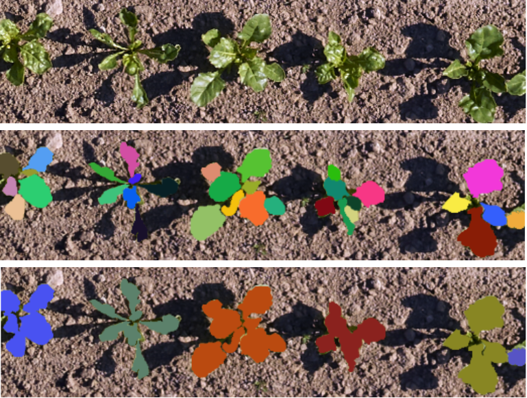
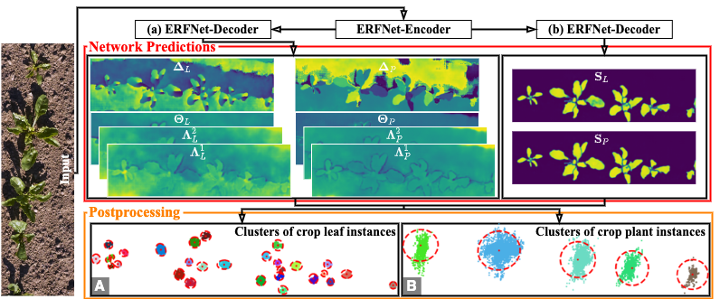

# In-Field Phenotyping Based on Crop Leaf and Plant Instance Segmentation

In this codebase we present an approach to perform in-field phenotyping based on
crop leaf and plant instance segmentation. 



We propose a vision-based approach that performs instance segmentation of
individual crop leaves and associates each with its corresponding crop plant in
real fields.

Our method is a bottom-up approach based on an end-to-end trainable
convolutional neural network~(CNN). We generate two different representations of
the input image that are eligible to cluster individual crop leaf and plant
instances within a predicted clustering region. 



## Prerequisites
Create a virtual environment and install dependencies:
```bash
conda create -n venv python=3.7
conda install pytorch==1.1.0 torchvision==0.3.0 cudatoolkit=9.0 -c pytorch
conda install matplotlib tqdm scikit-image pandas
conda install -c conda-forge tensorboard
conda install -c anaconda future
conda install -c conda-forge opencv 
conda install -c conda-forge pycocotools
conda install -c anaconda h5py
```

## Training

First, start training the network: 
```bash
export DATASET_DIR=path/to/dataset
python src/train.py
```

You can set different training options in the file ```train_config.py```.

Second, to perform the automated postprocessing step to cluster individual crop leaf and plant instances:
```bash
python src/report.py
```

You can set different postprocessing options in the file ```report_config.py```.

## Test

We provide a model pretraind on our dataset and a minimal example to perform instance segmentation of crop leaves and plants.

First, define the path to the provided dataset:
```bash
export DATASET_DIR=./dataset-mini
```

Second, make sure that the option ```only_eval``` in ```train_config.py``` is to ```True```

Third, we provide the pretrained model at ```./src/exp/```. Please make sure that the ```resume_path``` option in ```train_config.py``` is set accordingly.

You can run the model as following:
```bash
python src/train.py
```
This will save the model predicitions to disk at ```./logs```.

Finally, run the automated postprocessing to cluster individual crop leaf and plant instances:
```bash
python src/report.py
```

Please find a visualization of all predicitions in the directory ```./logs/reports```

## License

This software is released under a [creative commons license](https://creativecommons.org/licenses/by-nc/4.0/legalcode) which allows for personal and research use only.

## Attribution
- This work is partially based on [Instance Segmentation by Jointly Optimizing Spatial Embeddings and Clustering Bandwidth](https://arxiv.org/pdf/1906.11109.pdf), used under [CC BY](https://creativecommons.org/licenses/by-nc/4.0/)
- The authors are Davy Neven, Bert De Brabandere, Marc Proesmans, and Luc Van Gool (Dept. ESAT, Center for Processing Speech and Images KU Leuven)
- [Source](https://github.com/davyneven/SpatialEmbeddings/blob/master/README.md) is licensed under CC BY-NC 4.0


